# Linking Google Cloud Platform Project to Google Apps Script Project for New IDE

This is the document for linking Google Cloud Platform Project to Google Apps Script Project for New IDE. And also, several sample scripts using Google Apps Script API and Google Photos API are introduced.

## Introduction

At April 8, 2019, the specification of Google Apps Script Project was changed. You can see this at [Google Cloud Platform Projects](https://developers.google.com/apps-script/guides/cloud-platform-projects). The official document says as follows.

> Warning: Starting on or after April 8, 2019, the Google Cloud Platform Console won't be able to access the default GCP projects created for new Apps Script projects. Older, existing scripts may have default GCP projects that are still accessible, however. If you have a new script and require access to its GCP project from the Google Cloud Platform Console, you must use a standard GCP project.

And then,

> When a new Apps Script project is created, a default GCP project is also created behind the scenes. This GCP project is hidden, meaning most users aren't able to directly locate, view, or update the project in the Google Cloud Platform Console. However, admins and domain users that have the resourcemanager.projects.list permission on the parenting GCP folder are able to view and configure default projects.

By this, when users create new Google Apps Script Project (the container-bound script and the standalone script) after April 8, 2019, it is required to link Cloud Platform Project to the created Google Apps Script Project (GAS project).

And also, at December 7, 2020, new IDE for Google Apps Script was released. [Ref](https://developers.google.com/apps-script/releases/2020#december_7_2020)

In this document, I would like to introduce the flow for linking Cloud Platform Project to GAS project for new IDE.

When you want to check this document for the old one, you can see it at [here](https://tanaikech.github.io/2019/07/05/linking-cloud-platform-project-to-google-apps-script-project/).

## Linking Cloud Platform Project to Google Apps Script Project

In this section, by creating new Cloud Platform Project and new GAS project, the flow for linking Cloud Platform Project to GAS project is explained.

### 1. Create new GAS project.

1. In this case, you can create the projects of the container-bound script type and the standalone script type. When the GAS project is created after April 8, 2019 with the new IDE, when you see "Project Settings" at the script editor, the following screen can be seen.

   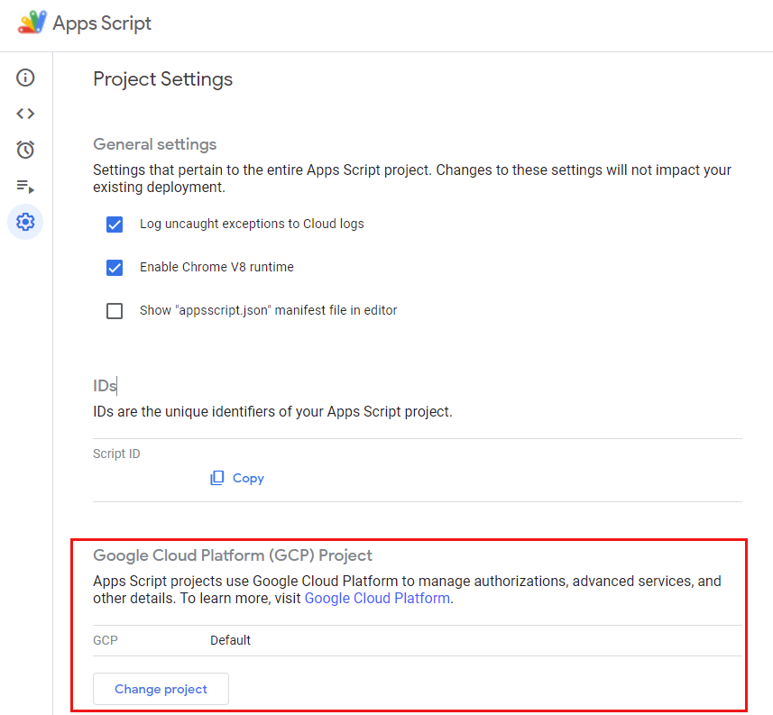

1. By this, when users want to use Google APIs except for Advanced Google Services, it is required to link Cloud Platform Project to this GAS project.

### 2. Create new Cloud Platform Project

1. Access to [Manage resources of Google Cloud Platform](https://console.cloud.google.com/cloud-resource-manager). And click "CREATE PROJECT" like below.

   - If you want to use the existing Cloud Platform Project, please use this.

   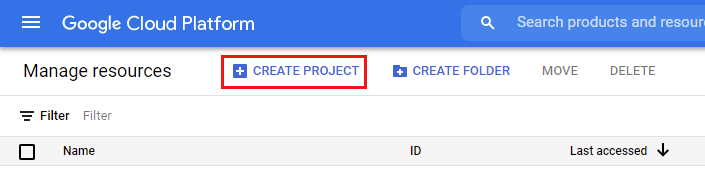

1. Input the project name and click "CREATE" button. In this sample, "Location" uses `No organization`.

1. You can see the created Cloud Platform Project by reloading "Manage resources of Google Cloud Platform".

1. For the cerated Cloud Platform Project, open the setting page by clicking "Settings" like below.

   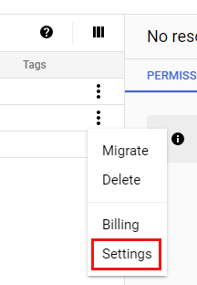

### 3. Retrieve the project number.

1. You can retrieve the project number like below. In this case, it's `123456789012`.

   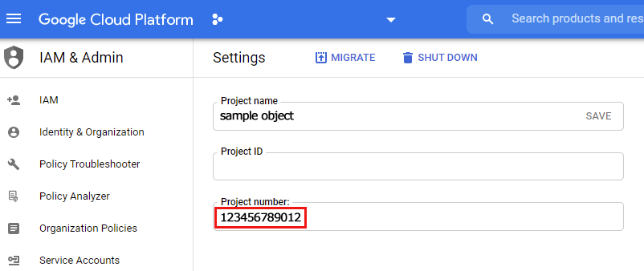

### 4. Create new credential.

**When new Cloud Platform Project is created, there are no credentials. So when users want to use Google API from outside, it is required to create new credentials.** In the most cases, this situation is required. So here, I would like to introduce to create new credentials. On the other hand, the GAS project linked to Cloud Platform Project automatically creates the credential.

1. From the navigation menu like below, and jump to "Credentials" from "API & Services".

   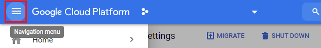

   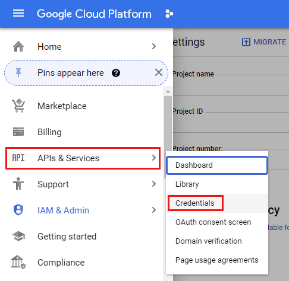

1. Before create the credential, open "CONFIGURE CONCENT SCREEN" like below.

   - In this sample, "External" is selected and click "CREATE".
   - And input "Application name", "User support email" and "Developer contact information", and click "SAVE AND CONTINUE" button.
   - And, in this sample, at "Scopes" and "Test users" just click "SAVE AND CONTINUE".
   - At "Summary", just click "BACK TO DASHBOARD".

   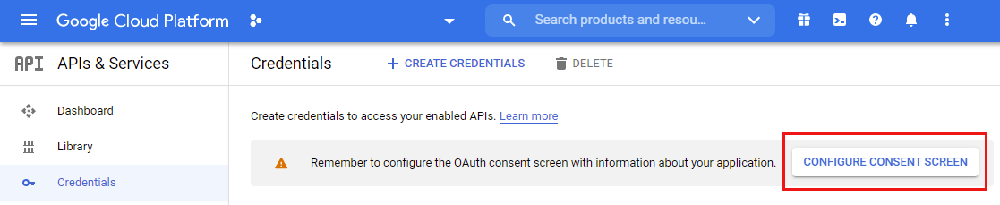

   - And, at DASHBOARD, at "Publishing status", click "PUBLISH APP", and click "CONFIRM". By this, the following situation can be seen.

   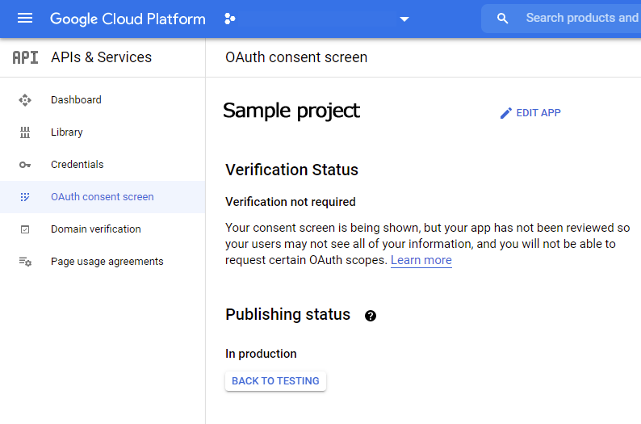

### 5. Link Cloud Platform Project to GAS project.

1. Open the script editor which is the created new GAS project.

1. Open "Project Settings" at the left sidebar of the script editor. You can see below dialog.

   

1. Click "Change project". And, put the retrieved project number to "GCP Project Number" and click "Set project".

   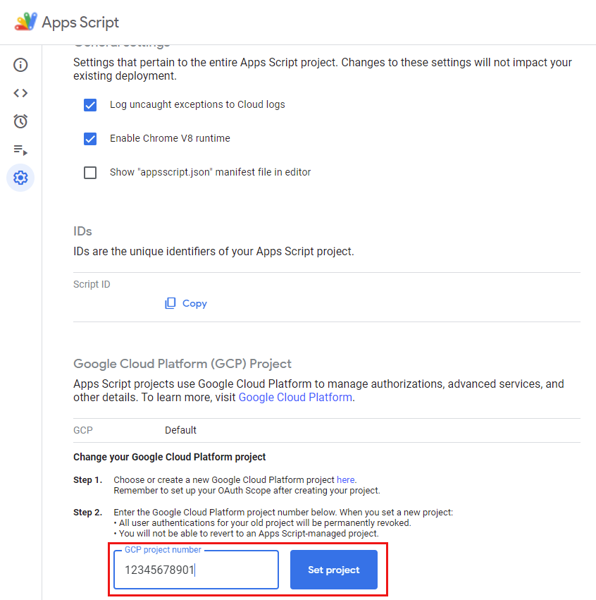

1. By this, you can see the following situation. It means that Cloud Platform Project was linked to GAS project. When you click the "Project Number", the GCP project is opened.

   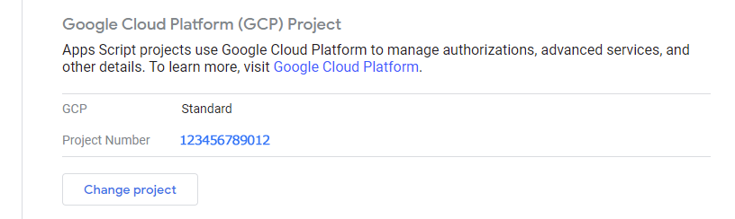

1. And, when you see "Credentials" of Google Cloud Platform, you can see "Apps Script" at "OAuth 2.0 Client IDs" as follows. By this, it is found that Google Cloud Project is linking to Google Apps Script project.

   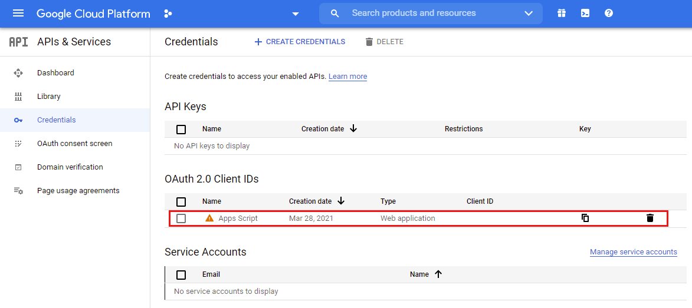

## Testing

In this section, I would like to introduce the sample scripts using the Google Apps Script project linked to Cloud Platform Project.

### Sample 1

In this sample, Google Apps Script API is used. In the current stage, Google Apps Script API cannot be used for the default created Google Apps Script. It is required to link the Google Apps Script project with Cloud Platform Project.

Tha following sample script, new Google Spreadsheet is created and new Google Apps Script project is created as the container-bound script, and then, the script is put to the created Google Apps Script project.

#### Prepare

The sample script is as follows. Please copy and paste the following script to the script editor which links to Google Cloud Platform Projects. And please install a Google Apps Script library of [ProjectApp2](https://github.com/tanaikech/ProjectApp2). The library key if this library is

```
11qqgrTfCEydqwIF8RRrSZOrdq-KNsIDnUpnYefX5KobaMMArVSlXUqwS
```

You can see the method for installing the library at [here](https://developers.google.com/apps-script/guides/libraries#add_a_library_to_your_script_project).

#### Sample script

```javascript
function myFunction() {
  const sampleScript = 'function myfunction() {console.log("ok")}';
  const blob = Utilities.newBlob(sampleScript).setName("Code.gs");
  const spreadsheetId = SpreadsheetApp.create("sampleSpreadsheet").getId();
  const res = ProjectApp2.createProjectByBlob(
    "sampleProject",
    [blob],
    spreadsheetId
  );
  console.log(res);
}
```

#### Result

When you run the script, you can see the following error message.

```json
{
  "error": {
    "code": 403,
    "message": "Apps Script API has not been used in project 3523622449 before or it is disabled. Enable it by visiting https://console.developers.google.com/apis/api/script.googleapis.com/overview?project=### then retry. If you enabled this API recently, wait a few minutes for the action to propagate to our systems and retry.",
    "status": "PERMISSION_DENIED",
    "details": [, , ,]
  }
}
```

In this case, please access to `https://console.developers.google.com/apis/api/script.googleapis.com/overview?project=###` using your browser, and please enable Google Apps Script API at API console. And, please run the script again.

When the following error occurrs,

```json
{
  "error": {
    "code": 403,
    "message": "User has not enabled the Apps Script API. Enable it by visiting https://script.google.com/home/usersettings then retry. If you enabled this API recently, wait a few minutes for the action to propagate to our systems and retry.",
    "status": "PERMISSION_DENIED",
    "details": [, , ,]
  }
}
```

Please access to `https://script.google.com/home/usersettings` using your browser and please change to "ON" for "Google Apps Script API" at "Settings". (When you had already done this, this process can be skipped. You can confirm that the script works.) And run the script again.

By this, you can see new Google Spreadsheet of `sampleSpreadsheet` at the root folder of your Google Drive. When you open the Spreadsheet and open the script editor, you can see the sample script of `function myfunction() {console.log("ok")}`.

### Sample 2

In this sample, Google Apps Script API is used. In the current stage, Google Apps Script API cannot be used for the default created Google Apps Script. It is required to link the Google Apps Script project with Cloud Platform Project.

Tha following sample script, a function is run using the method of "scripts.run" in Google Apps Script API. [Ref](https://developers.google.com/apps-script/api/reference/rest/v1/scripts/run)

In this sample script, it supposes that Google Apps Script API has already been enabled at API console. Please be careful this.

#### Sample script

Please copy and paste the following script to the script editor linked to Google Cloud Platform Projects. And, save the Google Apps Script project using the save button.

```javascript
function sample(value) {
  return { value: value };
}

function myFunction() {
  const url = "https://script.googleapis.com/v1/scripts/###:run";
  const payload = {
    function: "sample",
    devMode: true,
    parameters: ["sampleValue"],
  };
  const params = {
    method: "post",
    contentType: "application/json",
    payload: JSON.stringify(payload),
    headers: { authorization: `Bearer ${ScriptApp.getOAuthToken()}` },
  };
  const res = UrlFetchApp.fetch(url, params);
  console.log(res.getContentText());
}
```

- In this sample, as a test case, the method of "scripts.run" in Google Apps Script API is used in the same Project. You can also run the function of `sample()` from outside.

#### Deploy

1. Open "New deployment" dialog with "Deploy" -> "New deployment".
2. Select "API Executable" for "Select type".
3. Input "Description" and set "Only myself" for "API Executable". And, click "Deploy" button. And, copy "API Executable" and click "Done" button. By this, you can see the following endpoint.
   - `https://script.googleapis.com/v1/scripts/###:run`
4. Please replace `###` of `const url = "https://script.googleapis.com/v1/scripts/###:run";` in above sample script with your retrieved endpoint.

#### Result

After above settings, when `myFunction()` is run, the following result is obtained.

```json
{
  "done": true,
  "response": {
    "@type": "type.googleapis.com/google.apps.script.v1.ExecutionResponse",
    "result": {
      "value": "sampleValue"
    }
  }
}
```

When you got the following error,

```json
{
  "done": true,
  "error": {
    "code": 3,
    "message": "ScriptError",
    "details": [
      {
        "@type": "type.googleapis.com/google.apps.script.v1.ExecutionError",
        "errorMessage": "Script function not found: sample",
        "errorType": "ScriptError"
      }
    ]
  }
}
```

Please save the script using the save button and redeploy "API Executable" again and please copy and paste new endpoint to the script and test it again.

#### IMPORTANT

At March 15, 2021, one endpoint is created for one deployment. [Ref](https://developers.google.com/apps-script/releases/#march_15_2021) By this, when you redeploy "API Executable", the endpoint is changed. So please be careful this.

### Sample 3

In this sample, Google Photos API is used. In the current stage, Google Photos API cannot be used for the default created Google Apps Script. It is required to link the Google Apps Script project with Cloud Platform Project.

#### Prepare

The sample script is as follows. Please copy and paste the following script to the script editor which links to Google Cloud Platform Projects. And please install a Google Apps Script library of [GPhotoApp](https://github.com/tanaikech/GPhotoApp). The library key if this library is

```
1lGrUiaweQjQwVV_QwWuJDJVbCuY2T0BfVphw6VmT85s9LJFntav1wzs9
```

You can see the method for installing the library at [here](https://developers.google.com/apps-script/guides/libraries#add_a_library_to_your_script_project).

#### Sample script

```javascript
function createAlbum() {
  var resource = { album: { title: "sample title" } };
  const res = GPhotoApp.createAlbum(resource);
  console.log(res);
}
```

#### Result

When you run the script, you can see the following error message.

```json
{
  "error": {
    "code": 403,
    "message": "Photos Library API has not been used in project 3523622449 before or it is disabled. Enable it by visiting https://console.developers.google.com/apis/api/photoslibrary.googleapis.com/overview?project=### then retry. If you enabled this API recently, wait a few minutes for the action to propagate to our systems and retry.",
    "status": "PERMISSION_DENIED",
    "details": [, , ,]
  }
}
```

In this case, please access to `https://console.developers.google.com/apis/api/photoslibrary.googleapis.com/overview?project=###` using your browser, and please enable Google Photos API at API console. And, please run the script again.

When you obtained the following response,

```json
{
  "id": "###",
  "title": "sample title",
  "productUrl": "https://photos.google.com/lr/album/###",
  "isWriteable": true
}
```

When you check [https://photos.google.com/albums](https://photos.google.com/albums), you can see new album.

## References

- [Google Cloud Platform Projects](https://developers.google.com/apps-script/guides/cloud-platform-projects)
- [Linking Cloud Platform Project to Google Apps Script Project for old IDE](https://tanaikech.github.io/2019/07/05/linking-cloud-platform-project-to-google-apps-script-project/)
